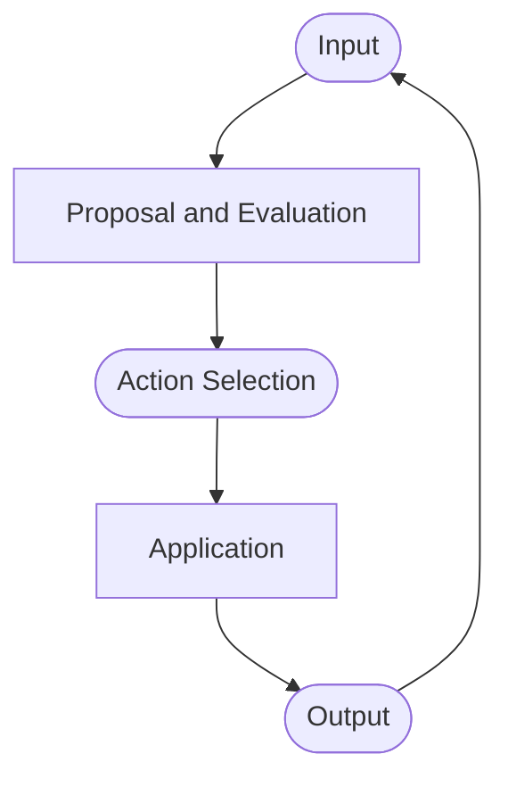

+++
title = "My First Presentation"
outputs = ["Reveal"]
+++

Contents:
- [Background](#background)
  - [Agents in Symbolic AI](#agents-in-symbolic-ai)
    - [Agents as String Manipulation Systems](#agents-as-string-manipulation-systems)
  - [Cognitive Agents](#cognitive-agents)
  - [Production Systems and Human Cognition](#production-systems-and-human-cognition)
    - [An Example: SOAR Architecture](#an-example-soar-architecture)
    - [*Memory*](#memory)
    - [*Grounding*](#grounding)
    - [*Decision Making*](#decision-making)
    - [*Learning*](#learning)
- [Language Models](#language-models)
  - [Cognitive Architectures Limitations](#cognitive-architectures-limitations)
  - [Language Models: Core](#language-models-core)
  - [Towards Language Agents](#towards-language-agents)
    - [Similarities with Production Systems](#similarities-with-production-systems)

---

## Background

With the term **Language Agents**, we refer to an emerging class of AI systems that use Large
Language Models (LLM) to interact with the world, applying together current advancement in AI to the
existing field of agent design, offering benefits for both fields.

---

{}
### Agents in Symbolic AI

The rise of Agents in symbolic AI comes from the concept of **Production Systems**:

> Production Systems generate a set of outcomes by iteratively applying rules

A production system basically consists of:

- A set of *rules*, each one specifying:
    - a *precondition*
    - an *action*

---

#### Agents as String Manipulation Systems

E. L. Post proposed thinking about arbitrary logical systems in terms of
production systems.

Later on, it will be shown to be equivalent to a simpler *string rewriting*
system of the form:

```math
XYZ \rightarrow XWZ
```

This lead to the definition of complex behaviours by means of simple
productions.

{}

---

### Cognitive Agents

---

### Production Systems and Human Cognition

AI community exploited some aspects of *"human cognition"* by means of
sophisticated production systems connected to external sensors, actuator and
knowledge bases. 

> **Cognitive Architectures**: agents that uses processes such as *perception*,
> *memory* and *planning* to archive complex behaviours.

---

{}

#### An Example: SOAR Architecture


Showcase usage of large production systems connected to external *sensors*, *actuators* and *knowledge bases*

------

#### *Memory*


- **Long Term Memories** (procedural, semantic, episodic)
- **Short Term Working Memory**

------

#### *Grounding*


- **Sensors** generates percepts
- **Actuators** allow physical interaction with environment

------

#### *Decision Making*

Decision loop that matches preconditions, checks them against working memory,
and choose and produce actions through a *propose and evaluate phase*.


---

#### *Learning*


Learning is supported in various forms:

- facts are written in **semantic memory**
- experiences written in **episodic memory**
- Adding/Rewriting to **procedural memory** through *Reinforcement Learning*

{}

---

## Language Models

---

### Cognitive Architectures Limitations

Cognitive architectures have two main problems:
- They are *limited to domains* that can be described with logical predicates
- Require many *pre-specified* rules in order to function properly

---

### Language Models: Core
A language model is a **probabilistic** input-output system where it learn a distribution

$$ P(w_i|w_{<i}) $$

Where each $w$ is an individual *token*.

Thanks to **Transformer Based** *LLM*s trained on internet-scale text, it has been shown how
these models are useful for many tasks beyond simple text generation.

---

### Towards Language Agents

In scenarios where LLMs act in interactive environment, we can talk about "*language agents*", i.e. systems
that use LLMs as a core computation unit to reason, plan and act.

---

#### Similarities with Production Systems

Both LLMs and Production Systems can be reduced to a *string rewriting problem*. For LLMs we can formulate the problem as
completing a piece of text as a production allowing multiple possible continuation:

$$ X \rightarrow XY_i $$

for some set of completion $Y_i$. LLM's output defines a **probability distribution** over **which productions to select** when presented with input $X$.