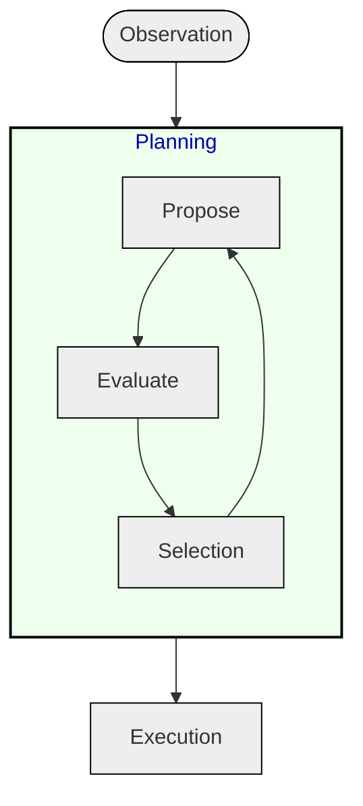
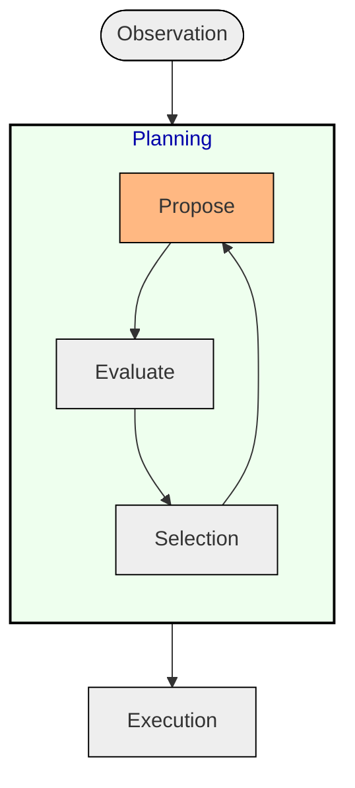
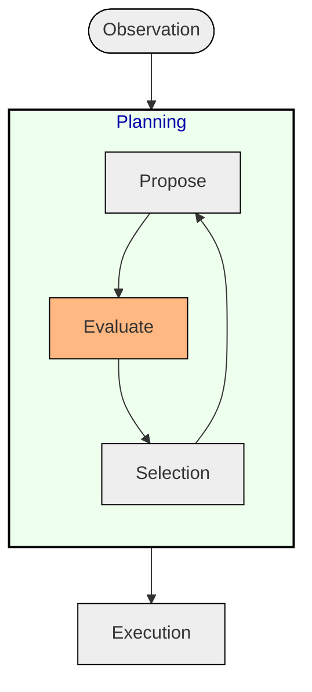
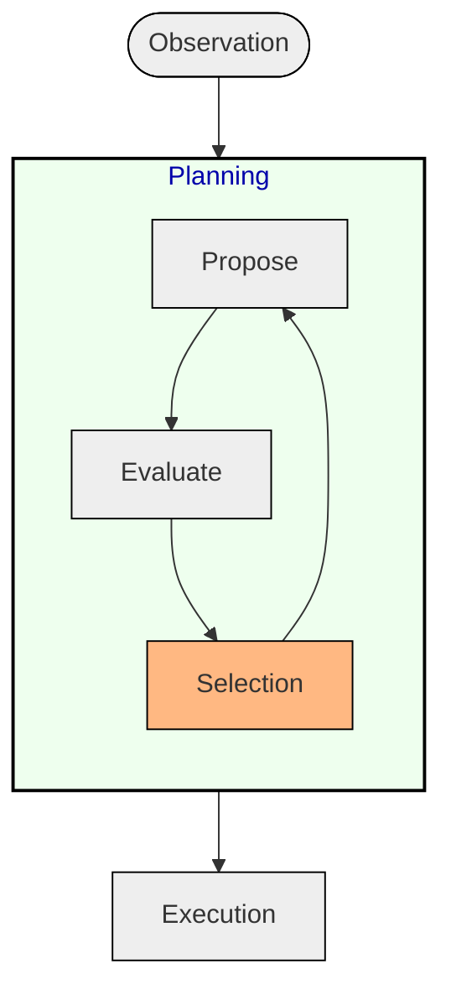
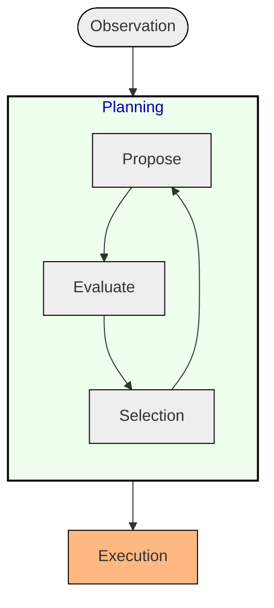

+++
title = "Cognitive Architectures for Language Agents"
outputs = ["Reveal"]
+++

Contents:
- [Background](#background)
  - [Agents in Symbolic AI](#agents-in-symbolic-ai)
    - [Agents as String Manipulation Systems](#agents-as-string-manipulation-systems)
  - [Cognitive Agents](#cognitive-agents)
  - [Production Systems and Human Cognition](#production-systems-and-human-cognition)
    - [An Example: SOAR Architecture](#an-example-soar-architecture)
    - [*Memory*](#memory)
    - [*Grounding*](#grounding)
    - [*Decision Making*](#decision-making)
    - [*Learning*](#learning)
- [Language Models](#language-models)
  - [Cognitive Architectures Limitations](#cognitive-architectures-limitations)
  - [Language Models: Core](#language-models-core)
  - [Towards Language Agents](#towards-language-agents)
    - [Similarities with Production Systems](#similarities-with-production-systems)
    - [From Prompt Engineering to Cognitive Language Agents](#from-prompt-engineering-to-cognitive-language-agents)
- [Cognitive Architecture for Language Agents (`CoALA`)](#cognitive-architecture-for-language-agents-coala)
  - [Usage of Cognitive Architectures on LLM agents](#usage-of-cognitive-architectures-on-llm-agents)
  - [`CoALA`](#coala)
  - [Architecture](#architecture)
    - [Memory](#memory-1)
      - [Working Memory](#working-memory)
      - [Episodic Memory](#episodic-memory)
      - [Semantic Memory](#semantic-memory)
      - [Procedural Memory](#procedural-memory)
    - [Grounding Actions](#grounding-actions)
      - [Physical Environment](#physical-environment)
      - [Dialogue with Humans or Other Agents](#dialogue-with-humans-or-other-agents)
      - [Digital Environment](#digital-environment)
    - [Retrieval Actions](#retrieval-actions)
    - [Reasoning Actions](#reasoning-actions)
    - [Learning](#learning-1)
      - [Updating Episodic Memory](#updating-episodic-memory)
      - [Updating Semantic Memory](#updating-semantic-memory)
      - [Updating LLM Parameters (Procedural Memory)](#updating-llm-parameters-procedural-memory)
      - [Updating Agent's Code (Procedural Memory)](#updating-agents-code-procedural-memory)
    - [Decision Making](#decision-making-1)
      - [Proposal](#proposal)
      - [Evaluation](#evaluation)
      - [Selection](#selection)
      - [Execution](#execution)
- [Insights](#insights)

---

## Background

With the term **Language Agents**, we refer to an emerging class of AI systems that use Large
Language Models (LLM) to interact with the world, applying together current advancement in AI to the
existing field of agent design, offering benefits for both fields.

---

{}
### Agents in Symbolic AI

The rise of Agents in symbolic AI comes from the concept of **Production Systems**:

> Production Systems generate a set of outcomes by iteratively applying rules

A production system basically consists of:

- A set of *rules*, each one specifying:
    - a *precondition*
    - an *action*

---

#### Agents as String Manipulation Systems

E. L. Post proposed thinking about arbitrary logical systems in terms of
production systems.

Later on, it will be shown to be equivalent to a simpler *string rewriting*
system of the form:

```math
XYZ \rightarrow XWZ
```

This lead to the definition of complex behaviours by means of simple
productions.

{}

---

### Cognitive Agents

---

### Production Systems and Human Cognition

AI community exploited some aspects of *"human cognition"* by means of
sophisticated production systems connected to external sensors, actuator and
knowledge bases. 

> **Cognitive Architectures**: agents that uses processes such as *perception*,
> *memory* and *planning* to archive complex behaviours.

---

{}

#### An Example: SOAR Architecture


Showcase usage of large production systems connected to external *sensors*, *actuators* and *knowledge bases*

------

#### *Memory*


- **Long Term Memories** (procedural, semantic, episodic)
- **Short Term Working Memory**

------

#### *Grounding*


- **Sensors** generates percepts
- **Actuators** allow physical interaction with environment

------

#### *Decision Making*

Decision loop that matches preconditions, checks them against working memory,
and choose and produce actions through a *propose and evaluate phase*.


---

#### *Learning*


Learning is supported in various forms:

- facts are written in **semantic memory**
- experiences written in **episodic memory**
- Adding/Rewriting to **procedural memory** through *Reinforcement Learning*

{}

---

## Language Models

---

### Cognitive Architectures Limitations

Cognitive architectures have two main problems:
- They are *limited to domains* that can be described with logical predicates
- Require many *pre-specified* rules in order to function properly

---

### Language Models: Core
A language model is a **probabilistic** input-output system where it learn a distribution

$$ P(w_i|w_{<i}) $$

Where each $w$ is an individual *token*.

Thanks to **Transformer Based** *LLM*s trained on internet-scale text, it has been shown how
these models are useful for many tasks beyond simple text generation.

---

### Towards Language Agents

In scenarios where LLMs act in interactive environment, we can talk about "*language agents*", i.e. systems
that use LLMs as a core computation unit to reason, plan and act.

---

#### Similarities with Production Systems

Both LLMs and Production Systems can be reduced to a *string rewriting problem*. For LLMs we can formulate the problem as
completing a piece of text as a production allowing multiple possible continuation:

$$ X \rightarrow XY_i $$

for some set of completion $Y_i$. LLM's output defines a **probability
distribution** over **which productions to select** when presented with input
$X$.

---

#### From Prompt Engineering to Cognitive Language Agents

Early works focused on prompt engineering techniques such as **few shot
learning** or **self reasoning** in order to bias the LLM towards high-quality
productions.

Subsequently, LLM has been placed directly inside the **feedback loop**,
interacting with an external environment and later incorporated with sophisticated
intermediate reasoning by means of interacting with long term memories.

---

## Cognitive Architecture for Language Agents (`CoALA`)

---

### Usage of Cognitive Architectures on LLM agents
Cognitive architectures has been used used to **structure production systems'
interactions with agents' internal state and external environment**, and they
can be rather useful for the same purposes in design LLM-based cognitive agents.

---

### `CoALA`

`CoALA` positions the LLM as the core component of a larger cognitive architecture, where a language agent stores information in **memory** modules, and acts
in an **action space** structured into *internal* and *external* parts.

---

### Architecture


---

{}
#### Memory

---

##### Working Memory

Maintains available information for the *current decision cycle*
- Perceptual Input
- Active reasoning variables
- Previous decision cycle variables
- Information retrieved from long-term memories

---

##### Episodic Memory

Stores **experiences** from earlier decision cycles. Can be accessed by the
working memory during the planning stage of a decision cycle to support
*reasoning*.

---

##### Semantic Memory

Stores agent's **knowledge** about the **world** and **itself**.

---

##### Procedural Memory

Divided in two forms:
- *Implicit* knowledge stored in the LLM weights
- **Explicit** knowledge written in the agent's code

{}

---

{}
#### Grounding Actions
Execute internal actions and process environmental feedback into working memory as text

---

##### Physical Environment

Involves processing inputs into textual observations and affect physical environment via robotic planners
that take **language-based commands**

---

##### Dialogue with Humans or Other Agents

By means of classical linguistic interaction can let the agent to accept new
instructions, and (if capable of generating text) ask for clarification or
collaborate with other agents/humans.

---

##### Digital Environment

Include interactions with games, APIs, as well as *general code execution*.

{}

---

#### Retrieval Actions

Can be seen as the general procedure for **reading information from long term memories** into working memory (e.g. *Rule Based* retrieval, *Sparse* retrieval, *Dense* retrieval, etc.)

---

#### Reasoning Actions
Reasoning consists of a set of actions that aim to the **processing** of the **content
of working memory** to generate new information

---

{}

#### Learning
Essentially a **writing process on long term memories** that can be accomplished in
various ways.

---

##### Updating Episodic Memory

Episodic Memory is updated with experiences, following RL common practice of storing
trajectories ato update a **parametric policy**.

--- 

##### Updating Semantic Memory

LLM reason about **raw experiences** and store resulting *inference* in semantic memory.

--- 

##### Updating LLM Parameters (Procedural Memory)

LLM parameters can be adapted to certain domains through **finetuning** during
its lifetime (e.g. supervised learning, imitation learning, environmental or AI
feedback).

--- 

##### Updating Agent's Code (Procedural Memory)

`CoALA` allows agents to update their source code in various ways:
- Update reasoning
- Update grounding actions
- Update retrieval
- Update learning or decision making


{}

---

{}

#### Decision Making

Main procedure that chooses which **action** to apply, structured into
**decision cycles** yielding an external grounding action or an internal
learning action.



---

##### Proposal

One or more action candidates are generated to sample one or more actions from the LLM



---

##### Evaluation

If multiple actions are proposed, a ranking and ordering is performed among them



---

##### Selection

Through argmax, softmax or MVR, an action is selected or rejects all the prosed ones



--- 
##### Execution

Selected action is applied executing relevant procedure from agent’s source code, leading to an external grounding action or an internal learning action.



{}

--- 

## Insights
